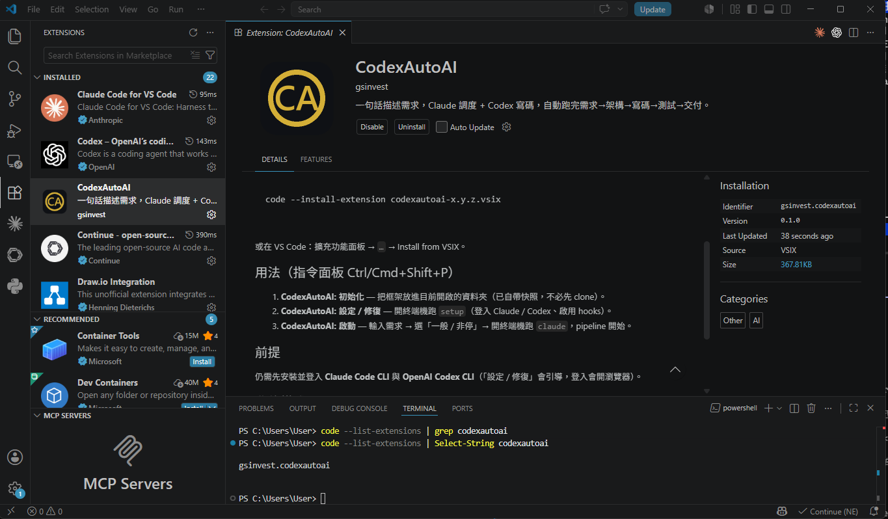

<p align="center">
  
</p>

# CodexAutoAI — 多 Agent 自動開發系統

**Claude Code 當「大腦／調用中心」，OpenAI Codex CLI 當「寫手」。**
你丟一句開發需求，系統自己跑完「需求 → 架構 → 審查 → 並行寫碼 → 測試 → 交付」七個階段，中途原則上不停下問你。

> 這個 repo 是**框架本體（一套工具）**，不是某個成品。
> 它跑出來的專案會放進 `src/`、`docs/`、`log/`（這些目錄預設不進版控，見 `.gitignore`）。

---

## 最簡單：桌面 App（不會用指令也能跑）

到 [Releases](https://github.com/gsinvest017-ai/gs-codex-auto-ai/releases) 下載 `CodexAutoAI-setup-x.y.z.exe` → 安裝 → 點桌面**金色圖示**。

App 會：環境檢查（Claude / Codex / Node / git）→ 一鍵「設定 / 修復」（登入、裝 Codex、啟用 hooks）→ 在輸入框打一句需求按 **🚀 啟動** → 自動開終端機跑完整七階段。

> **自動檢查更新**：App 啟動時會在背景比對 GitHub Release 的最新 `app-v*` 版本，有新版就在上方跳金色橫幅，按 **⬇ 立即更新** 即自動下載安裝檔並啟動更新（私有 repo，需先 `gh auth login` 或設定 `GH_TOKEN`）。

> 仍需先安裝並登入 **Claude Code** 與 **OpenAI Codex**（App 內「設定/修復」會逐步引導，登入會開瀏覽器）。
> 想自己 build：`pwsh installer/build-installer.ps1`（需 PyInstaller + Inno Setup 6）；開發測試：`run.cmd`。

不想用 App，想直接用指令 → 看下面。

---

## 用 VS Code？裝 extension（.vsix）

<p align="center">
  
</p>

到 [Releases](https://github.com/gsinvest017-ai/gs-codex-auto-ai/releases) 下載 `codexautoai-x.y.z.vsix`，然後二選一安裝：

```bash
code --install-extension codexautoai-x.y.z.vsix
```

或 VS Code 左側「擴充功能」面板 → 右上 `…` → **Install from VSIX…** → 選該檔。

裝好後用指令面板（`Ctrl/Cmd+Shift+P`）執行：

1. **CodexAutoAI: 初始化** — 把框架放進目前開啟的資料夾（extension **自帶框架快照，不必先 clone**）。
2. **CodexAutoAI: 設定 / 修復** — 開終端機跑 `setup`（登入 Claude / Codex、啟用 hooks）。
3. **CodexAutoAI: 啟動** — 輸入需求 → 選「一般 / 非停」→ 開終端機跑 `claude`，pipeline 開始。
4. **CodexAutoAI: 檢查更新** — 手動比對 GitHub Release 的最新 `ext-v*` 版本；啟動時也會自動查（每天一次，可在設定 `codexautoai.checkForUpdates` 關閉）。有新版會跳通知，按 **下載 .vsix** 取得新版重裝。

> 同樣仍需先安裝並登入 **Claude Code** 與 **OpenAI Codex**。
> 想自己 build：`pwsh vscode-extension/build-vsix.ps1`（產出 `dist/codexautoai-<ver>.vsix`）。
> 想發佈新版：`pwsh vscode-extension/release-vsix.ps1`（建 `ext-v<ver>` tag + 上傳 .vsix 到 Release）。

---

## 快速開始（三步）

### 步驟 1 — 一鍵首次設定

clone 後跑一次。它會一條龍完成「安裝/登入 Claude → 安裝/登入 Codex → 安裝/登入 gh → 啟用 git hooks」，**缺的 CLI 會自動智慧安裝**（claude/codex 用 npm；gh 用 winget→scoop→choco 擇一），**已完成的步驟會自動跳過**（可安全重跑），登入時會開瀏覽器，完成後自動往下。裝好並登入 gh 後，桌面 App / extension 的「自動檢查更新」即可直接運作。

```bash
# Windows：雙擊 setup.cmd，或在 PowerShell：
./setup.ps1

# Git Bash / Linux / macOS：
./setup.sh
```

> 想先看它會做什麼而不實際登入：加 `--dry-run`（bash）或 `-DryRun`（ps1）。
> 其他旗標：`--force-login` 強制重新登入、`--skip-hooks` 不裝 git hooks。

<details><summary>不想用腳本？手動指令（等價）</summary>

```bash
npm install -g @anthropic-ai/claude-code && claude login  # Claude Code 安裝 + 登入（開瀏覽器）
npm install -g @openai/codex && codex login               # Codex 安裝 + 登入（開瀏覽器）
winget install --id GitHub.cli -e && gh auth login --web  # GitHub CLI 安裝 + 登入（自動檢查更新用）
python tools/install_hooks.py                             # 啟用 git hooks（AGENTS.md 自動同步）
```
</details>

### 步驟 2 — 在這個資料夾開啟 Claude Code

```bash
cd gs-codex-auto-ai
claude
```

### 步驟 3 — 打 `/start`，或直接說出你的需求

```
/start
```

或直接描述需求，例如：

```
幫我做一個記帳 CLI 工具，可以新增/查詢/刪除支出，資料存 SQLite
```

**就這樣。** 接下來系統會自動接手，你不用再敲任何指令——除非它在 Phase 2 反問你需求細節（這是唯一會停下來問你的地方）。

---

## 接下來會發生什麼

系統會自動依序跑完七個階段（你只需在 Phase 2 回答澄清問題）：

| Phase | 在做什麼 | 你要做的事 |
|-------|---------|-----------|
| 0 初始化 | 建 `src/ tests/ docs/ log/` | 無 |
| 1 環境檢查 | 確認 Codex 可用 | 無 |
| **2 需求分析** | 判斷專案類型、拆功能 | **可能反問你細節 ← 唯一互動點** |
| 3 架構設計 | 拆 function、定介面、依賴分析 | 無 |
| 4 審查 | 跨模型審查架構（不過則自動修正循環） | 無 |
| 5 並行開發 | 多個 agent 同時呼叫 Codex 寫碼 | 無 |
| 6 測試 | 實跑測試（失敗則自動修正循環） | 無 |
| 7 交付 | 產出可跑專案 + 中文報告 | 驗收 |

> **重點**：除了 Phase 2 的澄清問題，全程自動推進、不會問「要繼續嗎？」。
> 它**不會**自動 `git commit` / `push` / 刪除專案外檔案——這些不可逆操作一定先問你（見 `DESIGN/project.md` C6）。

---

## 怎麼看進度

**最方便：同一個對話視窗自動顯示。** 只要有進行中的 run，你每次在 Claude Code 送出訊息時，視窗頂端就會自動出現進度條（由 `UserPromptSubmit` hook 注入；閒置時自動靜默）。也可以隨時打 `/progress` 主動查看。

```
[CodexAutoAI] Phase 3/7 ▓▓▓▓░░░░ 架構設計  ● 進行中
            已完成階段：[0, 1]
            當前迭代：第 2 輪（守衛上限 3）
            累計成本：$0.0123 USD
```

需要在獨立終端機持續盯著看，也可以：

```bash
python tools/progress.py          # 印一次
python tools/progress.py --watch  # 持續刷新（每 2 秒）
```

進度資料來自 `log/events.jsonl`——其中 phase 邊界事件由 orchestrator **確定性寫入**（不靠 LLM 記得），所以進度條保證會推進。

---

## 不停下來問人（非停模式）

這個 repo **預設就不會逐一問你工具權限**（`.claude/settings.json` 設了 `bypassPermissions`）——
所以跑一跑不會卡在「要允許這個指令嗎？」。同時開**多個 session** 也各自順跑、互不干擾。

- **保留的安全停點**：`git commit` / `push` / `reset --hard` / `rm -rf` 等不可逆操作仍會**停下來問你**（憲章 C6）。
- **連回合都不想停**：打 `/autopilot on <把需求一次講完>`。它會用 Stop hook 把流程一路推到 Phase 7 交付（上限 30 次續跑、per-session 獨立）；`/autopilot off` 關閉、`/autopilot status` 看進度。
- 首次在新機器開這個資料夾時，Claude Code 會要你「信任此資料夾」一次，才會套用上述設定（這是天然的 opt-in 關卡）。

---

## 產出在哪

| 路徑 | 內容 |
|------|------|
| `src/` | 產出的程式碼 |
| `tests/` | 產出的測試 |
| `docs/{專案}-report.md` | 交付報告（依專案類型套用 `docs/templates/` 模板） |
| `log/` | 執行日誌（JSONL 事件 + Markdown 摘要） |

---

## 可靠性引擎（重構後「真正接上」運行時）

v2 的確定性引擎（`src/codexautoai_v2/`）以前只有規格與測試、執行時從沒被呼叫；現在由 `tools/` 的橋接器真正驅動。**控制流由 Python 擁有，Codex 只是被驅動的 worker，不是 LLM 自己在循環。** 這些工具由各 Phase 的 skill 自動呼叫，使用者通常不必手動敲。

| 工具 | 作用 | 對應 Phase |
|------|------|-----------|
| `tools/run_phase.py` | phase 邊界事件確定性寫入 `log/events.jsonl`（進度來源）；run_id 跨 phase 持久化，支援 `resume` 中斷續跑 | 全程 |
| `tools/run_loop.py` | 把 review-fix 迴圈交給 `Orchestrator`：**三守衛（迭代上限 / 無進度 / 預算）真正強制**，卡住會 escalate 而非無限燒 token | 4、6 |
| `tools/run_build.py` | `plan`：拓樸排序 + **循環依賴直接拒絕**；`gen-tests`：由 EARS 生成屬性測試；`build`：worktree 隔離建置（opt-in） | 4.5、5 |
| `tools/repo_context.py` | 給 Codex prompt 預算內的 symbol 摘要而非整檔，省 token | 5 |

實際保證（已用真實 Codex 端到端驗證「加法 CLI」全七階段）：

- **有界終止**：修復迴圈最多 3 輪、缺陷集不縮小或超預算即停 → 一次 replan → 升級通知你，**不會無限循環**。
- **不會跑壞 git**：絕不自動 `commit` / `push`；worktree 建置有護欄拒絕在框架 repo 執行。
- **可恢復**：中斷後 `/start` 會問是否從上次的 phase 續跑，不必從頭重來。
- **全程可觀測**：每個 phase / 每輪迭代 / 累計成本都進 `log/events.jsonl`，餵給進度視圖。

---

## 想更深入

| 想知道 | 看這裡 |
|--------|--------|
| 框架怎麼運作（角色分工、控制流） | `docs/codexAutoAI-architecture-analysis.md` |
| 可靠性引擎怎麼接上運行時（橋接器） | `tools/run_phase.py`、`tools/run_loop.py`、`tools/run_build.py` |
| 治理規則（不可逆邊界、信任邊界、終止守衛） | `DESIGN/project.md`（憲章） |
| v2 可靠性重構的設計規格 | `DESIGN/changes/2026-06-19-v2-reliability-overhaul/` |
| 調度邏輯與各 agent/skill 定義 | `CLAUDE.md`、`.claude/agents/`、`.claude/skills/` |

> `CLAUDE.md` 裡的 `/phaseN` 指令是**調度中心內部自動呼叫**的機制，使用者一般不用手動敲。你只需要 `/start` 或一句需求。

---

## 維護者：改指令的規則

git hooks 已由步驟 1 的 `setup` 啟用（或單獨跑 `python tools/install_hooks.py`）。之後：

> 規則：**只改 `CLAUDE.md`**（唯一 SSOT），`AGENTS.md` 由 `.githooks/pre-commit` 在 commit 時自動重生並一起進 commit，別手動編輯。
> 遠端另有 GitHub Actions CI（`.github/workflows/ci.yml`）把關 sync 與測試。
